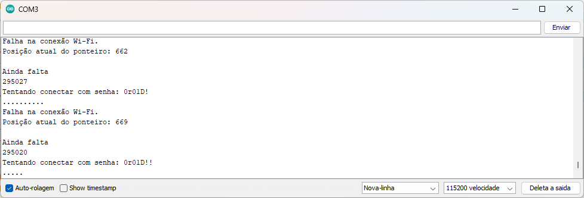

# Wi-Fi Brute Force com ESP8266 (NodeMCU ESP-12E)

Este projeto implementa uma técnica de **brute force (força bruta)** para encontrar a senha de uma rede Wi-Fi, utilizando um microcontrolador **ESP8266 (NodeMCU ESP-12E)**. Ele tenta se conectar repetidamente a uma rede Wi-Fi utilizando uma lista de senhas armazenadas no sistema de arquivos **LittleFS**.

⚠️ **Este projeto é para fins educacionais e de testes em redes próprias. O uso não autorizado pode ser ilegal e antiético.**

---



---

## Funcionalidade

O código realiza as seguintes ações:

1. Lê uma lista de senhas do arquivo `/wordlist.txt`, armazenado no sistema de arquivos **LittleFS**.
2. Tenta conectar-se à rede Wi-Fi especificada com cada senha da lista.
3. Se a conexão for bem-sucedida:
   - Salva a senha encontrada na **EEPROM**.
   - Ativa o LED indicando sucesso.
   - Interrompe novas tentativas.
4. Se a lista acabar sem sucesso:
   - Marca o fim das tentativas na EEPROM.
   - Ativa o LED para indicar falha.

---

## Bibliotecas Utilizadas

O projeto usa as seguintes bibliotecas padrão da plataforma ESP8266:

- [`ESP8266WiFi.h`](https://arduino-esp8266.readthedocs.io/en/latest/esp8266wifi/readme.html) – Para conexão Wi-Fi.
- [`LittleFS.h`](https://arduino-esp8266.readthedocs.io/en/latest/filesystem.html) – Para ler o arquivo de senhas da memória flash.
- [`EEPROM.h`](https://arduino-esp8266.readthedocs.io/en/latest/libraries.html#eeprom) – Para armazenar o estado da tentativa e a senha descoberta.

---

## Requisitos Importantes

- Este código **funciona apenas com versões antigas da IDE do Arduino**, preferencialmente **versão 1.8.x**, por ser mais compatível com o suporte a placas ESP8266 sem alterações extras.
- Certifique-se de que a placa **"NodeMCU 1.0 (ESP-12E Module)"** esteja instalada via o gerenciador de placas do ESP8266.
- Use o sistema de arquivos **LittleFS** (não SPIFFS). Instale a ferramenta de upload de arquivos LittleFS correspondente à sua IDE:  
  [ESP8266 LittleFS Tool](https://github.com/earlephilhower/arduino-esp8266littlefs-plugin)

---

##  Estrutura Esperada

O sistema de arquivos do ESP8266 deve conter o arquivo:

data/wordlist.txt

- A wordlist deve estar dentro de uma pasta chamada data.
- Cada linha deve conter uma senha a ser testada.
- As senhas devem terminar com uma quebra de linha `\n`.

Exemplo de `wordlist.txt`:

```txt

12345678
senha123
meuwifi2024
admin123

```

---

## Aviso Legal

Este código é fornecido **exclusivamente para fins educacionais e testes em redes sob seu controle**. Qualquer uso em redes sem autorização **é ilegal** e pode violar leis locais de privacidade e segurança de redes. Tem o propósito único de demonstrar a importância de se utilizar politicas de segurança para redes Wi-fi, dentre elas destaco o uso de whitelist que impediria um usuário não catalogado de acessar a rede e o uso de um SSID oculto.

---

## Upload e Execução

1. Compile o código com a IDE Arduino 1.8.x.
2. Faça o upload do arquivo `wordlist.txt` com a ferramenta LittleFS.
3. Envie o código para o ESP8266.
4. Acompanhe o comportamento por LED ou via porta serial (em versões de teste).

---

## Compilação de Teste e desenvolvimento

Configurações recomendadas:
- Placa: `NodeMCU 1.0 (ESP-12E Module)`
- Frequência: `80 MHz`
- Flash Size: `4MB (FS:1MB OTA:~1019KB)`
- Porta: selecione a porta correta do seu ESP8266

---

## Possíveis Modificações Futuras

- Criar interface web para acompanhar o progresso das tentativas.
- Armazenar estatísticas de tentativas para análise futura.

---


